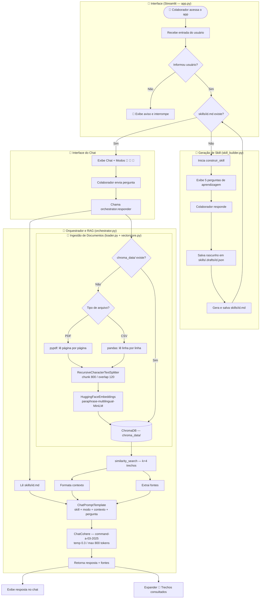

# 🎓 Employee Skill Facilitator


Agente tutor adaptativo alimentado por IA que aprende o perfil de cada colaborador e responde perguntas sobre os documentos internos da empresa usando RAG (Retrieval-Augmented Generation).

---

## Descrição geral

O agente combina duas capacidades:

- **Perfil de aprendizagem** — na primeira sessão, o agente faz 5 perguntas para entender o estilo, nível técnico e prioridades do colaborador. O perfil é salvo e injetado em todos os prompts seguintes, personalizando o tom e a profundidade das respostas.
- **RAG sobre documentos internos** — a cada pergunta, o agente recupera os trechos mais relevantes dos documentos da empresa (PDF/CSV) e os usa como contexto para o LLM gerar a resposta, sem inventar informações.

O colaborador escolhe o modo de cada pergunta na sidebar:

| Modo | Comportamento |
|---|---|
| 🎯 Tirar dúvida | Resposta curta e direta, apenas o essencial |
| 🌱 Aprender do zero | Resposta completa com contexto suficiente para entender o assunto do zero |
| 🔎 Aprofundar | Resposta detalhada cobrindo trade-offs, limitações e implicações práticas |

---

## Arquitetura da solução

```
employee-skill-facilitator/
├── app.py                        # Interface Streamlit — roteamento e chat
├── agent/
│   ├── orchestrator.py           # Orquestra RAG + skill + LLM
│   ├── skill_builder.py          # Conversa guiada para montar o perfil
│   └── rag/
│       ├── loader.py             # Lê todos os PDF/CSV da pasta data/
│       └── vectorstore.py        # Chunks, embeddings e ChromaDB
├── data/
│   └── *.pdf / *.csv             # Documentos internos da empresa
├── skills/
│   └── <usuario>.md              # Perfil persistente do colaborador
├── chroma_data/                  # Índice vetorial (gerado automaticamente)
├── requirements.txt
```

**Fluxo de uma pergunta:**
<details>
    <summary>Clique aqui</summary>


</details>


---

## Tecnologias e ferramentas

| Camada | Tecnologia |
|---|---|
| Interface | Streamlit |
| LLM | Cohere `command-a-03-2025` |
| Embeddings | `sentence-transformers/paraphrase-multilingual-MiniLM-L12-v2` (local, sem API) |
| Vector store | ChromaDB |
| Orquestração | LangChain |
| Leitura de PDF | pypdf |
| Leitura de CSV | pandas |

---

## Instruções para executar

### 1. Clone o repositório e instale as dependências

```bash
git clone <url-do-repositorio>
cd employee-skill-facilitator
pip install -r requirements.txt
```

### 2. Configure as variáveis de ambiente

Crie um arquivo `.env` na raiz do projeto:

```env
COHERE_API_KEY=<sua_chave_cohere>
COHERE_MODEL=command-a-03-2025
```

### 3. Adicione os documentos da empresa

Coloque os arquivos `.pdf` ou `.csv` na pasta `data/`. Todos serão indexados automaticamente na primeira execução.

### 4. Rode o app

```bash
streamlit run app.py
```

O índice vetorial é criado automaticamente na primeira pergunta. Para reindexar após adicionar novos documentos:

```bash
rm -rf chroma_data/
```

### Deploy no Streamlit Cloud

1. Suba o repositório no GitHub (inclua a pasta `data/` com os documentos)
2. Em **Settings > Secrets**, adicione:
   ```
   COHERE_API_KEY = <sua_chave_cohere>
   COHERE_MODEL = command-a-03-2025
   ```

> ⚠️ O índice vetorial não persiste entre deploys no Streamlit Cloud — ele é recriado a cada nova instância.

---

## Exemplos de perguntas que o agente consegue responder

Com base nos documentos indexados da EDV, Empresa de Evolução Digital:

- *Quais são os planos disponíveis e quanto custam?*
- *O que é o EDV Flow e quais são seus principais módulos?*
- *Como recupero um fluxo que excluí por engano?*
- *Quais dados a empresa coleta sobre mim?*
- *O que é um agente de IA e como ele funciona?*
- *Quais frameworks são usados para construir agentes?*
- *Qual a diferença entre LangChain e LangGraph?*
- *O plano Starter suporta quantas execuções por mês?*

---

## ☁️ Deploy - Streamlit Community Cloud

A aplicação está implantada no Streamlit Community Cloud e acessível publicamente.

**🔗 Acesso:** [employee-skill-facilitator](https://employee-skill-facilitatorgit-53zq2yheixjtuz6qg3uybv.streamlit.app/)

<details>
    <summary>Demonstração da aplicação em execução no  Streamlit Community Cloud</summary>


</details>

---

## Exemplos de respostas geradas pelo agente

**Pergunta:** O que é o EDV Flow?

> 🎯 *Tirar dúvida*
>
> O EDV Flow é a plataforma SaaS da EDV para automação de fluxos de trabalho digitais. Permite conectar sistemas e automatizar tarefas sem escrever código.

---

**Pergunta:** O que é um agente de IA?

> 🌱 *Aprender do zero*
>
> Um agente de IA é um LLM colocado dentro de um ciclo com acesso a ferramentas — como buscar na web, consultar um banco de dados ou executar código. Em vez de só responder uma pergunta, ele decide quais passos dar para resolver um objetivo. Pense nele como um assistente que não só sabe as respostas, mas também consegue agir para encontrá-las.

---

**Pergunta:** Qual a diferença entre LangChain e LangGraph?

> 🔎 *Aprofundar*
>
> LangChain encadeia prompts, ferramentas e memória em uma "chain" linear — ideal para RAG e fluxos simples. LangGraph é construído sobre o LangChain e modela o agente como um grafo de estados, permitindo loops, decisões condicionais e múltiplos agentes colaborando. O trade-off: LangChain é mais simples de começar; LangGraph dá mais controle para fluxos complexos, mas exige mais configuração.
